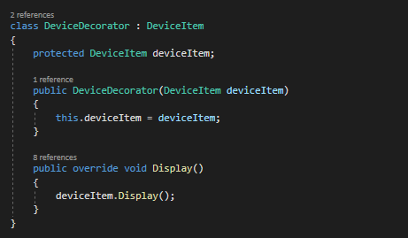

# Topic: Structural Design Patterns
###### Author: Dina Ciorba
# Objectives:
##### 1. Study and understand the Structural Design Patterns;
##### 2. As a continuation of the previous laboratory work, thinking about the functionalities that my system will need to provide to the user;
##### 3. Implement some additional functionalities using structural design patterns;
# Theory:
Structural design patterns are patterns that describe how objects and classes can be combined and form a large structure and that ease design by identifying a simple way to realize relationships between entities. There are seven structural patterns described.
### Design Patterns examples:
- Adapter
- Proxy
- FlyWeight
- Facade
- Decorator
- Composite
- Bridge
# Implementation:

In this project I have implemented 3 Structural Design Patterns, which are Composite, Adapter and Decorator. As a domain I used Factory which manufactures devices 
and prepares packages with aditional supplies for them. Using these 3 structural design pattern I've implement some additional functionalities like: adapting device package elements to a representation well-defined for users, indicating device specifications and color; composing orders structure for daily reports including all sold devices and their details; making devices open to feedback given by customers;
For the Composite design pattern I have 4 participant classes: AddingElement.cs (Component) which declares the interface for objects in composition, implements default behavior for the interface common to all classes and declares an interface for accessing and managing its child components. Namely it provides adding device to an order functionality.

Next is PrimitiveElement.cs (Leaf) which represents leaf objects in the composition and defines behavior for primitive objects in the composition. Practically it defines each detail and specification for the ordered device and has no children.

Also, I have CompositeOrder.cs (CompositeElement) which defines behavior for components having children, stores child components and implements child related operations in the Component interface. It allows adding and removing elements from the order.

The 4th class is the client who manipulates objects in the composition through the Component interface.

For the Adapter design pattern I have 4 component classes: IClient which defines the domain-specific interface that Client uses, with method GetRequest(). Practically it gets the device package details for the user interface.
Next is PackageAdaptee.cs which defines an existing interface that needs adapting, with methods GetSpecification() and GetColor() for each device model ordered by the user. The 3rd class is PackageAdapter which adapts the interface PackageAdaptee to the Client interface.

The 4th class is main app which collaborates with objects conforming to the Client interface.

For Decorator design pattern I have 5 participant classes as well. First is DeviceItem.cs which defines the interface for objects that can have responsibilities added to them dynamically. It provides number of device copies sold and displays it, in order for user to appreciate device rating.

Next are the concrete components Tablet and Smartphone, which define an object to which additional responasibilities can be attached. For example Smartphone class implements DeviceItem and displays device name, its rating, and number of sold copies:

Also, I have DeviceDecorator.cs which maintains a reference to a DeviceItem object and defines an interface that conforms to DeviceItem's interface.

Last one is OpenToFeedback.cs which adds responsibilities to the component. Namely it allows each customer to rate the device and displays its name.

In final this application provides a list of devices that Factory manufactures and allows user to input the device model they want to purchase. After it user is able to see the rating of this device given by other customers. Also, a list of sold device is provided with their specific details at the time of current day.

# Screenshot:

