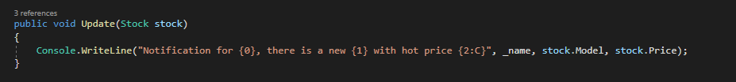
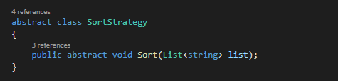
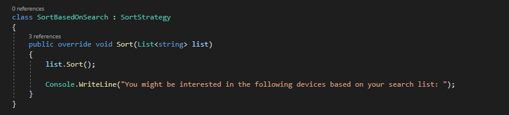
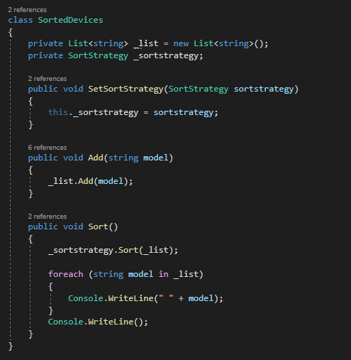
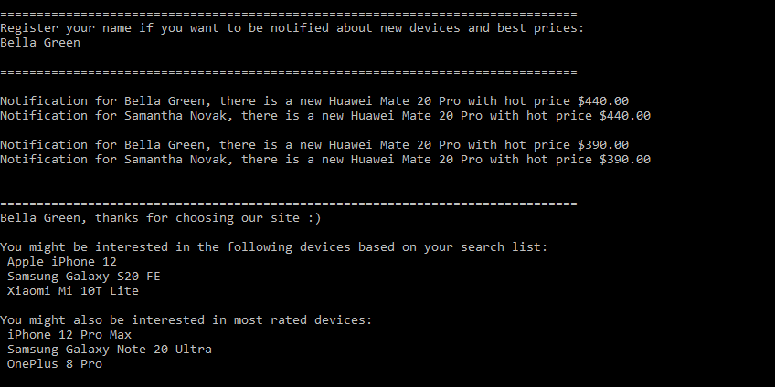

# Topic: Behavioral Design Patterns
###### Author: Dina Ciorba
# Objectives:
##### 1. Study and understand the Behavioral Design Patterns;
##### 2. As a continuation of the previous laboratory work, thinking about what communication between software entities might be involed in my system;
##### 3. Implement some additional functionalities using behavioral design patterns;
# Theory:
Behavioral design patterns are concerned with algorithms and the assignment of responsibilities between objects. They allow our objects to communicate with each other, whether it be one-to-one or many-to-one. By doing so, these patterns increase flexibility in carrying out communication. Examples of behavioral design patterns include:
### Design Patterns examples:
- Chain of responsability
- Command
- Interpreter
- Iterator
- Mediator
- Memento
- Observer
- Strategy
- Visitor
# Implementation:

In this project I have implemented 2 Behavioral Design Patterns which are Observer and Strategy. As a domain I used Factory which manufactures devices 
and prepares packages with additional supplies for them. Using this behavioral design pattern I've implement some additional functionalities like: 
* notifying specific clients which are interested in new devices and best prices; [Observer]
* providing a list of sorted devices based on two algorithms: sort by user's search list and by reviews; [Strategy]

With Observer design pattern I defined a one-to-many dependency between objects so that when one object changes state, all its dependents are notified and updated automatically. For its implementation I have 4 participant components: Stock.cs [Subject], Device.cs [ConcreteSubject], IClient.cs [Observer] and Client.cs [ConcreteObserver].

The UML diagram looks like following:

The __Stock.cs__ class from _device_factory_ folder knows its clients and provides an interface for attaching and dettaching IClient objects.

__Device.cs__ class from _device_ folder stores state of interest to Client and sends a notification to its clients when its state changes.

__IClient.cs__ interface from _client_ folder defines an updating interface for objects that should be notified of changes from the Stock.

__Client.cs__ class from _client_ folder maintains a reference to a Device object, it stores state that should stay consistent with the Stock's state and implements the IClient updating interface to keep its state consistent with the Stock state.

With Strategy design pattern I define a family of algorithms, encapsulated each one, and made them interchangeable. Strategy lets the algorithm vary independently from clients that use it. The classes and objects participating in this pattern are: SortStrategy.cs [Strategy], SortBasedOnSearch.cs and SortBasedOnReviews.cs [ConcreteStrategy], SortedDevices.cs [Context]. The UML diagram looks like following:

__SortStrategy.cs__ from _device_ folder declares an interface common to all supported algorithms. Context uses this interface to call the algorithm defined by a Concrete Strategy.

__SortBasedOnSearch.cs__ & __SortBasedOnReview__ classes implements the algorithm using the Strategy interface.

__SortedDevices.cs__ is configured with a Concrete Strategy object, it maintains a reference to a Strategy object and may define an interface that lets Strategy access its data.

In final this application provides a list of devices that Factory manufactures and allows user to input the device model they want to purchase. After it user is able to see the rating of this device given by other customers. Also, a list of sold device is provided with their specific details at the time of current day. Due to __Observer__ design pattern client is able to register their name if they want to be notified about new devices and hot prices. Only interested users are notified. With __Strategy__, users are able to see a sorted list of devices based on their search list and based on highest reviews that devices have.

# Screenshot:

