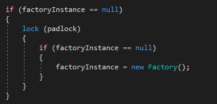
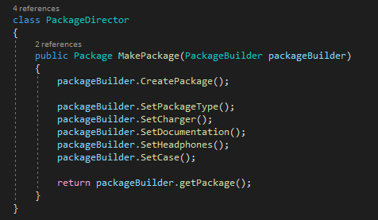
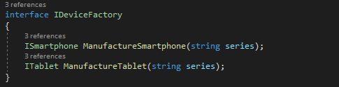

# Topic: Creational Design Patterns
###### Author: Dina Ciorba
# Objectives:
##### 1. Study the Creational Design Patterns
##### 2. Implement some of them in real project
# Theory:
Creational Design Patterns are used for controlling object creation process or instantiation of a class. We can easily say that Creational Design Patterns are all about the 
rules and the standards that we want for our class’ and objects’ creation process. We need them because constructors may not be efficient enough all the time : they may be
too flexible or too strict for our scenario or they may be expensive to use.
The point of creational patterns can be realized in the caller of the object. Keywords for creational design patterns are : Delegation and Inheritance.
### Design Patterns examples:
- Singleton
- Builder
- Prototype
- Object Pooling
- Factory Method
- Abstract Factory
# Implementation:

In this project I have implemented 3 Creational Design Patterns, which are Singleton, Abstract Factory and Builder. As a domain I used Factory which manufactures devices 
and prepares packages with aditional supplies for them.
The Singleton pattern I implemented in Factory class itself, because I want it have only one instance and provide a global access point to it. I have a private static 
attribute for the instance and a private empty constructor to prevent object creation with “new” keyword.

In order to check if instance is null I create a new one and use lock to be thread-safe without the necessity of taking out a lock every time.

For the Builder Design Pattern implementation I created a class Package which represents the product class with defined attributes (such as Charger, Documentation,
Headphones, Case and PackageType) which are common for a device package. I also defined a ShowPackageDetails() to display all the elements from the package. Next I created 
the Abstract Builder class PackageBuilder which provides the blueprint to create different types of packages. In this case subclasses (such as SmartphonePackageBuilder, 
TabletPackageBuilder) are implementing this abstract PackageBuilder class. Also, I have PackageDirector class with one generic method i.e. MakePackage() which will 
take PackageBuilder instance as an input parameter and then create and return a particular package object.

As Abstract Factory pattern implementation, I created an interface IDeviceFactory which will be the abstract factory for producing devices.

ISmartphone and ITablet are abstract products.
As concrete factories there are Xiaomi and HP classes which implement the abstract factory to manufacture different types of devices(smartphones and tablets).
We will get i.e. XiaomiMiSmartphone, HpEliteSmartphone as concrete products.
To manufacture devices by following this abstract factory I created a class Client with GetManufacturedProduct methods.
# Screenshot:

